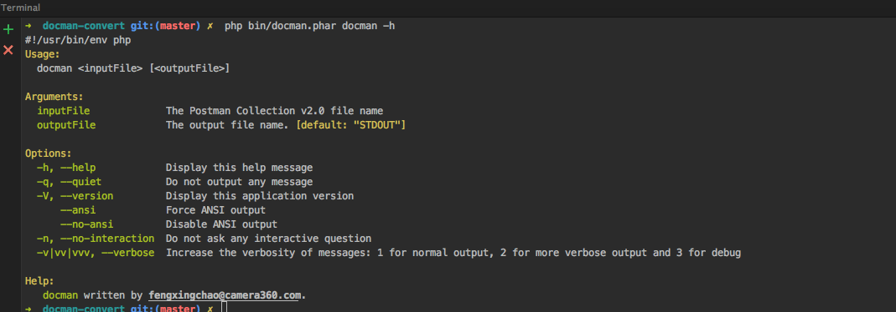

# docman-convert
Postman Collection v2.0 to apidoc.js syntax comment

# Get Started.

Basic Usage:


```
Usage:
  docman <inputFile> [<outputFile>]

Arguments:
  inputFile             The Postman Collection v2.0 file name
  outputFile            The output file name. [default: "STDOUT"]

Options:
  -h, --help            Display this help message
  -q, --quiet           Do not output any message
  -V, --version         Display this application version
      --ansi            Force ANSI output
      --no-ansi         Disable ANSI output
  -n, --no-interaction  Do not ask any interactive question
  -v|vv|vvv, --verbose  Increase the verbosity of messages: 1 for normal output, 2 for more verbose output and 3 for debug

Help:
   docman written by fengxingchao@camera360.com.

```

# Features.

+ none
+ @apiSuccessExample support
+ auto detect response data type.
+ compression response array.
+ simple
+ ...
